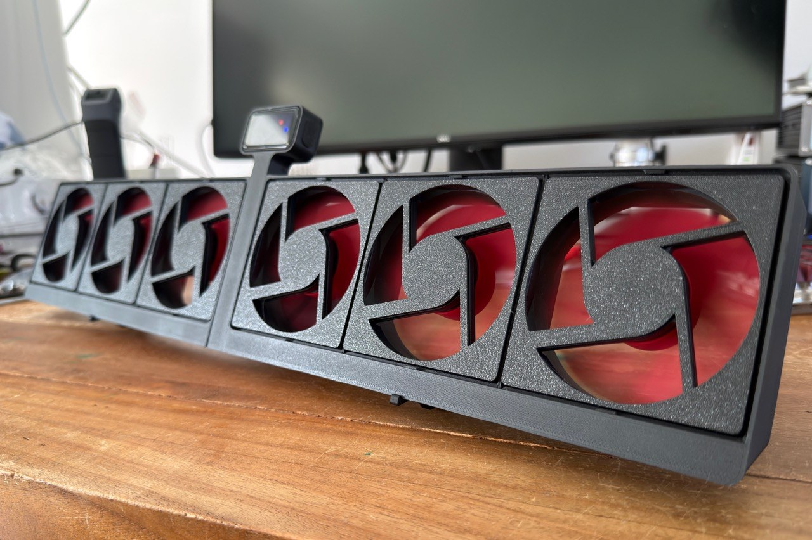
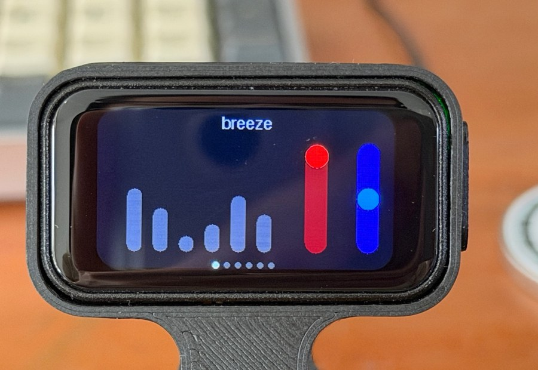
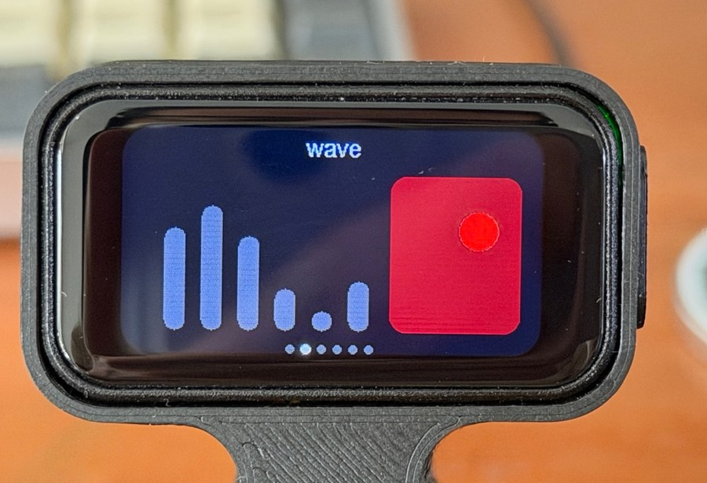
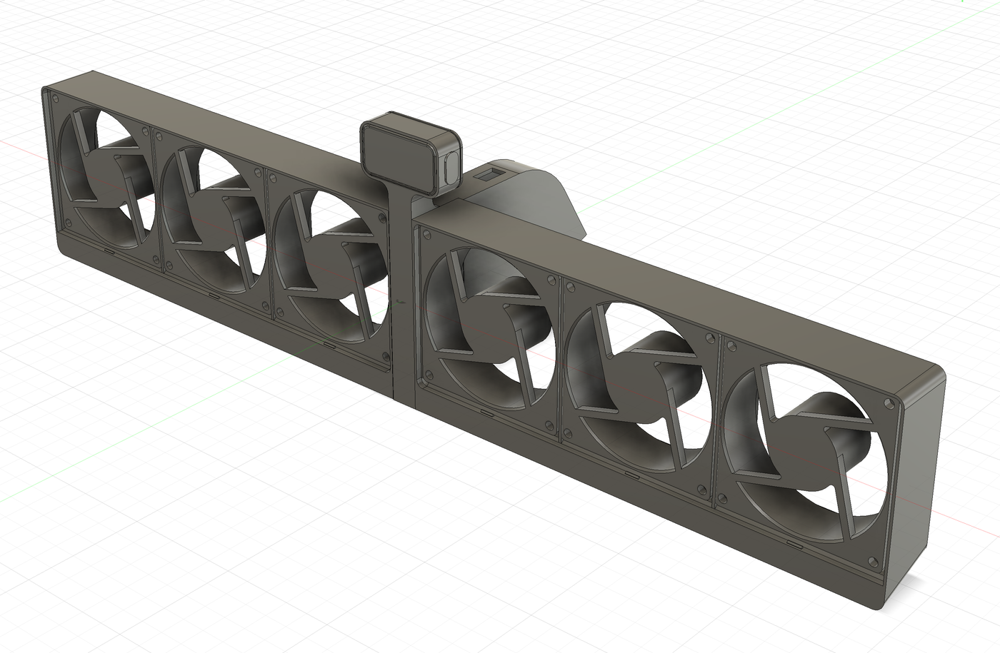
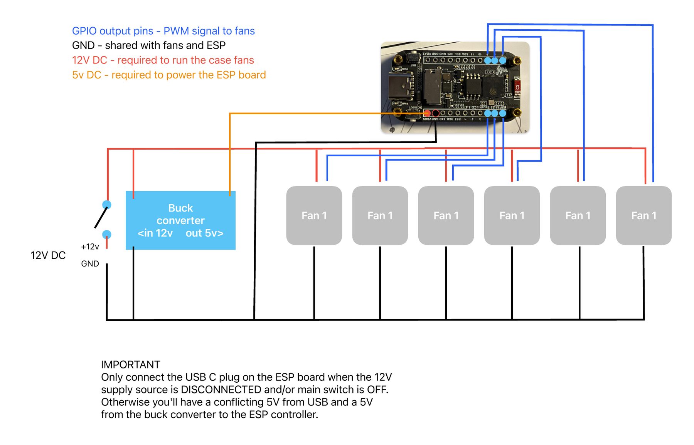

# DeskFanArray

A 3D-printed bar of six PWM case fans, driven by an ESP32-S3 with a built-in touch display. Pick an airflow pattern on the screen, such as a gentle breeze, a travelling wave or a pulse, and the fans do the rest.



Full project document (wiring, UI design, parts): [docs/README.pdf](docs/README.pdf)

## Features

- **Six 80 mm fans** with independent PWM speed control (any PWM fan works)
- **Touch UI** on a Waveshare ESP32-S3 1.47" display board, with seven screens, one per mode
- **Fully 3D-printed housing**, designed in Fusion 360
- **Single 12 V input** (match your fans' voltage); a buck converter makes the 5 V for the controller
- **Arduino firmware** with a configurable startup screen

## Control UI

The display has seven screens, one per mode. The dots at the bottom show which screen you are on. The six grey bars mirror the current speed of each fan; the coloured controls set the parameters of the active mode.

| breeze | wave |
|---|---|
|  |  |

| Screen | Controls |
|---|---|
| breeze | Two sliders: *peak gust* (red) and *gustiness* (blue) |
| wave | 2D pad for *wave height* and *direction* |
| monotone | One slider sets all fans to the same speed |
| stereotone | Two sliders, one for each half of the array |
| custom | Six sliders, one per fan |
| pulse | Two sliders (red and amber) for the pulsing pattern |

**Default screen:** press and hold (`longPress`) on a control screen to make it the default. On power-up, that screen is shown first.

The complete UI design sketch is in [docs/images/ui-overview.png](docs/images/ui-overview.png).

## Hardware



| Part | Notes |
|---|---|
| ESP32-S3 touch LCD, 1.47" | Waveshare board; runs the UI and generates the six PWM signals |
| 6 x 80x80 mm PWM case fans | Xilence XPF80.R PWM in this build (12 V). Each fan's PWM wire goes to its own GPIO pin |
| Buck converter | 12 V in, 5 V out; powers the ESP board |
| 12 V DC supply + switch | Main switch on the +12 V line |
| 3D-printed housing | Two case halves and a midsection, from the Fusion 360 model |
| 4 x M3 bolts + nuts | Mount the two case halves to the midsection |
| 4 x M2 bolts | Mount the controller to the midsection |

Any fan will do as long as it accepts a PWM input. If your fans need a voltage other than 12 V, adapt the supply voltage accordingly, and make sure the buck converter accepts that input voltage and still delivers 5 V to the controller.

## Wiring

All fans share the 12 V rail and a common ground with the ESP board. The buck converter drops 12 V to 5 V for the controller, and six GPIO pins send PWM signals to the fans.



> **IMPORTANT:** Only connect the USB-C plug on the ESP board when the 12 V supply is disconnected and/or the main switch is OFF. Otherwise the board receives a conflicting 5 V from USB and from the buck converter.

## Repository layout

```
DeskFanArray/
  docs/                      wiring diagram, UI design, board photo, project PDF
  models/Fusion/             Fusion 360 housing model
  src/DeskFanController/
    DeskFanController.ino    firmware
    startup_image.h          startup image data
```

## Build and flash

1. Open `src/DeskFanController/DeskFanController.ino` in the Arduino IDE.
2. Select the Waveshare ESP32-S3 touch LCD 1.47" board (ESP32-S3 core) and the matching USB port.
3. Disconnect the 12 V supply (see the warning above), connect USB-C, and upload.
4. Disconnect USB, then power the unit from the 12 V supply.

## License

Not yet specified.
